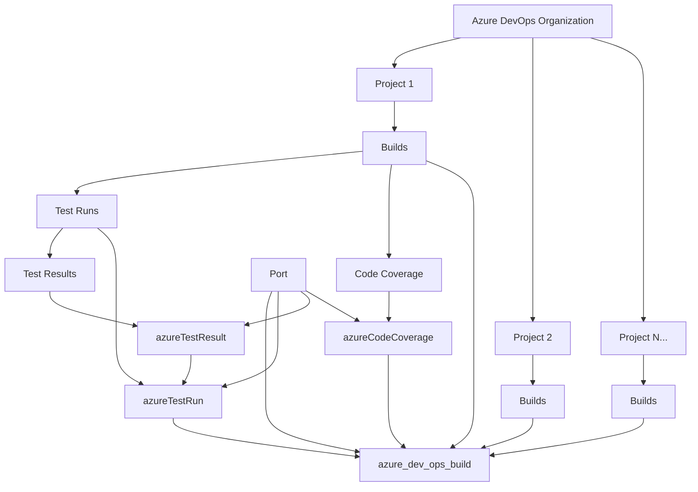

# Azure DevOps Tests & Code Coverage Analysis Integration

This script ingests **test execution data and code coverage analysis** from all projects in an Azure DevOps organization into Port, providing comprehensive visibility into your testing and quality metrics.

---

## 📋 Prerequisites

Before running the script, ensure you have the following:

- ✅ **Port Client ID and Secret**  
  Required to authenticate with the Port API for ingesting test and coverage data.  
  [Documentation](https://docs.getport.io)

- ✅ **Azure DevOps Personal Access Token (PAT)**  
  Used to access Azure DevOps test execution and code coverage APIs.  
  [Create PAT](https://docs.microsoft.com/en-us/azure/devops/organizations/accounts/use-personal-access-tokens-to-authenticate)  
  **Required Scopes**: `Build (read)`, `Test Management (read)`, `Code (read)`

- ✅ **Azure DevOps Organization with Test Data**  
  Organization with projects that have test runs and code coverage reports from build pipelines.

- ✅ **Port Azure DevOps Integration**  
  Install the Azure DevOps integration in Port to automatically ingest projects and repositories first.  
  [Install Integration](https://app.getport.io/dev-portal/integrations/azuredevops)

---

## 🔧 Blueprints

### 🧩 Azure DevOps Build

```json
{
  "identifier": "azure_dev_ops_build",
  "title": "Azure DevOps Build",
  "icon": "AzureDevops",
  "schema": {
    "properties": {
      "message": {
        "type": "string",
        "title": "Message"
      },
      "build_id": {
        "type": "number",
        "title": "Build Id"
      },
      "build_number": {
        "icon": "DefaultProperty",
        "type": "string",
        "title": "Build Number"
      },
      "status": {
        "type": "string",
        "title": "Status"
      },
      "owning_repository": {
        "type": "string",
        "title": "Owning Repository"
      }
    },
    "required": []
  },
  "relations": {
    "repository": {
      "title": "Repository",
      "target": "azureDevopsRepository",
      "required": false,
      "many": false
    }
  }
}
```

---

### 🧩 Azure Test Run

```json
{
  "identifier": "azureTestRun",
  "title": "Azure Test Run",
  "icon": "AzureDevops",
  "schema": {
    "properties": {
      "state": {
        "type": "string",
        "enum": ["NotStarted", "InProgress", "Completed", "Aborted", "NeedsInvestigation", "Stopped"]
      },
      "totalTests": { "type": "number" },
      "passedTests": { "type": "number" },
      "failedTests": { "type": "number" },
      "skippedTests": { "type": "number" },
      "startTime": { "type": "string", "format": "date-time" },
      "completeTime": { "type": "string", "format": "date-time" },
      "durationSec": { "type": "number" },
      "branchName": { "type": "string" },
      "commitId": { "type": "string" },
      "automated": { "type": "boolean" },
      "subType": { "type": "string" }
    },
    "required": []
  },
  "relations": {
    "build": {
      "title": "Build",
      "target": "azure_dev_ops_build",
      "required": false,
      "many": false
    },
    "pipeline": {
      "title": "Pipeline",
      "target": "azureDevopsPipeline",
      "required": false,
      "many": false
    },
    "repository": {
      "title": "Repository",
      "target": "azureDevopsRepository",
      "required": false,
      "many": false
    }
  }
}
```

---

### 🧩 Azure Test Result

```json
{
  "identifier": "azureTestResult",
  "title": "Azure Test Result",
  "icon": "AzureDevops",
  "schema": {
    "properties": {
      "testCaseTitle": { "type": "string" },
      "outcome": {
        "type": "string",
        "enum": ["Passed", "Failed", "NotExecuted", "Blocked", "Warning", "Aborted"]
      },
      "durationMs": { "type": "number" },
      "owner": { "type": "string" },
      "priority": { "type": "number" },
      "automatedTestName": { "type": "string" },
      "automatedTestType": { "type": "string" },
      "errorMessage": { "type": "string" },
      "stackTrace": { "type": "string" }
    },
    "required": []
  },
  "relations": {
    "run": {
      "title": "Test Run",
      "target": "azureTestRun",
      "required": true,
      "many": false
    }
  }
}
```

---

### 🧩 Azure Code Coverage

```json
{
  "identifier": "azureCodeCoverage",
  "title": "Azure Code Coverage",
  "icon": "AzureDevops",
  "schema": {
    "properties": {
      "moduleName": { "type": "string" },
      "covered": { "type": "number" },
      "total": { "type": "number" },
      "percentage": { "type": "number" },
      "reportUrl": { "type": "string" },
      "coverage_type": { "type": "string", "title": "Coverage Type" }
    },
    "required": []
  },
  "relations": {
    "repository": {
      "title": "Repository",
      "target": "azureDevopsRepository",
      "required": false,
      "many": false
    },
    "build": {
      "title": "Build",
      "target": "azure_dev_ops_build",
      "required": false,
      "many": false
    }
  }
}
```

---

## 🚀 Running the Script

### 1. Update Credentials

Edit the script and update the following placeholders in the configuration section:

```python
ADO_ORG = "<YOUR_AZURE_DEVOPS_ORGANIZATION>"  # e.g., "contoso"
ADO_PAT = "<YOUR_AZURE_DEVOPS_PERSONAL_ACCESS_TOKEN>"

PORT_CLIENT_ID = "<YOUR_PORT_CLIENT_ID>"
PORT_CLIENT_SECRET = "<YOUR_PORT_CLIENT_SECRET>"
```

---

### 2. Install Dependencies

```bash
pip install requests
```

---

### 3. Set Up Port Integration

Before running the script, you need to set up the Azure DevOps integration in Port:

1. **Install the Azure DevOps Integration**  
   Go to [Port Integrations](https://app.getport.io/dev-portal/integrations/azuredevops) and install the Azure DevOps integration.

2. **Configure the Integration**  
   Set up the integration with your Azure DevOps organization to automatically ingest:
   - Projects (`azureDevopsProject`)
   - Repositories (`azureDevopsRepository`) 
   - Pipelines (`azureDevopsPipeline`)

3. **Verify Ingestion**  
   Ensure that projects and repositories appear in your Port catalog before running the sync script.

---

### 4. Run the Script

Once the credentials are set:

```bash
python main.py
```

This will:
- ✅ Authenticate with Port using OAuth client credentials
- ✅ Discover all projects in your Azure DevOps organization
- ✅ Analyze builds from each project (last 30 days by default)
- ✅ **Extract and ingest test execution data** (test runs, results, outcomes)
- ✅ **Extract and ingest code coverage analysis** (line coverage, module coverage)
- ✅ Create comprehensive test and quality metrics in Port
- ✅ Link test data to builds and repositories for full traceability

---

## 🔄 Data Flow



---

## 🧠 Notes

- **Focus on Quality Metrics**: Primarily ingests test execution and code coverage data for quality analysis
- **Comprehensive Test Coverage**: Captures test outcomes, duration, error messages, and stack traces
- **Code Coverage Analysis**: Ingests line coverage, module coverage percentages, and coverage reports
- Script uses `upsert=true` to avoid duplicates and update existing entities
- Repository relations are dynamically mapped using `{project}/{repo-name}` format
- OAuth tokens are generated fresh on each run for security
- Error handling ensures the script continues processing even if individual builds lack test data

---

## 🔧 Customization

You can modify the following in the script:

- **Time Range**: Change `days=30` in the `get_recent_builds()` call to adjust the test data lookback period
- **API Versions**: Update API version parameters if needed for your Azure DevOps instance
- **Blueprint Mapping**: Update blueprint identifiers if your Port instance uses different names
- **Test Data Filtering**: Add filters to focus on specific test types or coverage thresholds

---

For more information, visit [getport.io](https://www.getport.io) and [Azure DevOps REST API Documentation](https://docs.microsoft.com/en-us/rest/api/azure/devops/).
